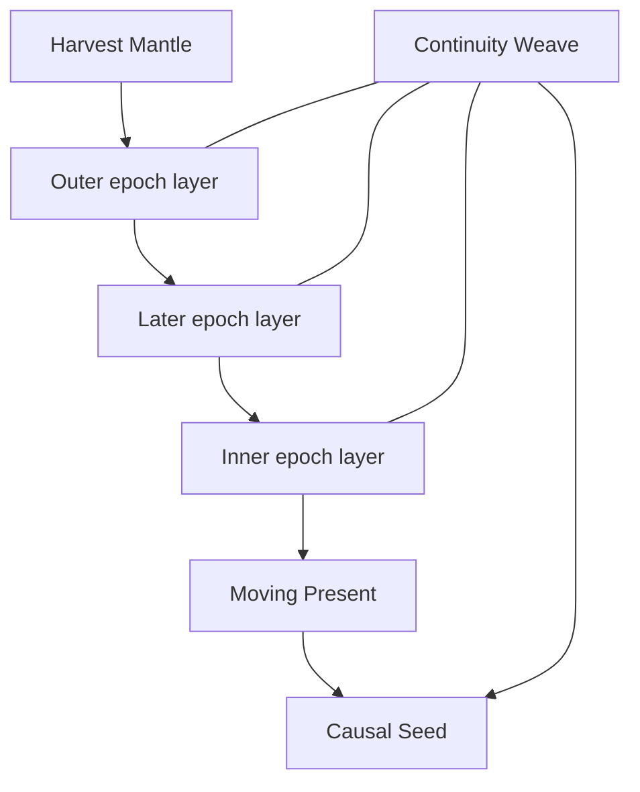

# Nullseed

Authoritative entry for the Nullseed, a terminal-class evolutionary megastructure of the Stapledon programme. Wiki summary: [`wiki.md`](wiki.md) §22. Clocks and the early timeline: [`chronology.md`](chronology.md). Probe ancestry: [`probes.md`](probes.md). Tags: [`../schema/status-tags.md`](../schema/status-tags.md).

This file adds a later class. It does not revise the 2085–2095 dispatch, the 0.2c coast, the 982 ly work distance, the plate-mass examples, the three Habitat Cuts, or the stills. If a sentence here fights a tagged claim about those locks, or tries to fill an item in [`open-questions.md`](open-questions.md), the earlier lock wins.

## Classification

**CANON.** The locks below are the entry's header. Detail and limits follow.

| Field | Lock |
| --- | --- |
| Name | Nullseed |
| Classification | Terminal-class evolutionary megastructure |
| Parent civilisation | Stapledon Swarm. On this branch, the stellar-era industry is the Kepler-62 cell swarm. |
| Primary function | Preserve and propagate conscious civilisation across cosmological epochs. |
| Inhabitants | Human-origin whole-brain emulations (WBEs); other stored human mind-records; synthetic intelligences (SIs), including artificial superintelligences (ASIs); consensual composites; collective and distributed minds; successor minds with non-human architectures. |
| Architecture | Harvest Mantle; Epoch Lattice; Continuity Weave; Moving Present; Causal Seed. |
| Evolutionary principle | Progressive substrate compression, resource conservation, and physical-domain independence. |
| Final objective | Carry conscious civilisation past the thermodynamic viability of the parent universe. |
| External dating | Cosmological epoch labels. No Gregorian construction year. |
| Final transition | Topology-preserving vacuum bifurcation. Fictional setting physics. Not a 2085–2095 probe capability. |

**CANON.** "Terminal-class" means the last structural class defined for the parent universe. Growth is an early phase with an end condition. Later phases reduce what must stay powered. The word does not mean that the minds have stopped, and it does not mean a ruined habitat.

**CANON.** The Nullseed is one megastructure class inside this setting. Published discussions of orbiting habitats, infrared stellar collectors, hibernating cosmologies, and vacuum decay exist outside the fiction. This entry does not claim priority over those discussions. It specifies how this class behaves here.

**CANON.** The five subsystems are one design. The mantle builds and feeds. The lattice schedules which layer is alive. The Weave stores minds and records. The Moving Present is where authorised minds run. The Causal Seed is the last apparatus, and its bridge is fictional physics.

## Overview

**CANON.** The Nullseed is the far-future descendant architecture of the Stapledon programme. Its inhabitants are computational minds and the records those minds require. Its engineering problem is to keep authorised minds able to run after hydrogen-fusing stars are no longer a usable power supply, and after indefinite growth has stopped paying for itself.

**CANON.** A young Stapledon industry spreads. Original probes carry seeds, archives, and dormant minds. After capture, cells proliferate and specialise. The Nullseed is adopted only once that post-biological industry exists. It first accumulates reserves and redundant records. It then moves the active population onto smaller, colder, more economical substrates and spends the outer structure down. Powered extent shrinks. The external-time interval the remaining core is built to cross gets longer.

**CANON.** The object is specified as a technological system with successive operational forms. A later form dismantles, recycles, or abandons an earlier form under an energy budget. There is no extra metabolism, genome, or life cycle beyond the energy, heat, and information budgets in this entry.

**CANON.** "Post-biological" here means that the continuing Nullseed population is implemented as computational minds. Stellar-era biological communities can still exist under the practices in [`preservation.md`](preservation.md). This entry does not decide whether any WBE is instantiated in a body at Kepler-62. That remains OPEN.

**CANON.** The key-art frames [`../stills/01-eclipse.jpg`](../stills/01-eclipse.jpg), [`../stills/02-lattice.jpg`](../stills/02-lattice.jpg), and [`../stills/03-inward.jpg`](../stills/03-inward.jpg) show the stellar-era field of independently orbiting cells. They are not portraits of the Nullseed. Launch frames `04`–`07` are gram-class sails at Earth. No Nullseed still is stored in this repo.

## Historical origins

**CANON.** The ancestry is the programme in [`probes.md`](probes.md) and the timeline in [`chronology.md`](chronology.md). Reader-facing dates for that history are Gregorian A.D. in a declared Sol-barycentric frame. The Nullseed does not add a year to that table.

**CANON.** From 2045–2058 the setting contains the first convincing human WBEs. Behavioural resemblance, memory continuity, and subjective identity are already different questions. From 2058–2070, ASIs and consenting WBEs form integrated cognition. Some stay identifiable. Some become composites. From 2065–2076, picotechnology means picometre-precision fabrication by larger atomic and molecular machines. From 2085–2095, about one billion original Von Neumann probes are dispatched in batches of thousands. A probe body is 1–10 g plus a sail. It carries dormant WBE and ASI states, picobot seeds, and a finite archive. It does not run a civilisation.

**CANON.** Settlement at Kepler-62 occurs. The mechanism that takes an original 0.2c coast into a bound orbit stays OPEN. Industry, archive verification, computation, and selected activation come after successful capture, in that order, with no calendar lock. Cells then proliferate on independent orbits inside an outer radius of 3.6 AU. They specialise. Energy, manufacturing, computation, archives, embodied habitation, and preservation practice are different jobs. Lineages persist as construction ancestry, including rules for activating or migrating stored minds. See [`lineages.md`](lineages.md).

**CANON.** The featured Habitat-kit cell is one relic computing and archive habitat inside that stellar-era swarm. Its active population migrated. Some damaged or unresolved archives stayed because no restoration met the fidelity and consent tests. One relic cell is not a dead swarm, and it is not the Nullseed. Mantle recycling is not the explanation of that hull. The physical failure sequence stays OPEN. See [`featured-cell.md`](featured-cell.md).

**CANON.** Phase I of the Nullseed is the later decision, inside that post-biological civilisation, to stop treating further habitat spread as the end state. The decision has no Gregorian date. It sits in the provisional band: after cells and archives exist, and before the cosmological phases below. Whether a later, faster mission reached Kepler-62 before the original probes stays OPEN. Either way, the builders are Stapledon descendants. This entry does not pick a batch, a founder, or a government.

**CANON.** Local, nearby, and distant shares of the original billion probes stay OPEN. This entry does not census how many branches complete a Nullseed. It locks the class. Parallel branches are not given copies by implication.

**CANON.** Nothing in the origin story closes destination braking, clock hardware, cell count, plate fill, the mining status of Kepler-62e or 62f, subatomic machines on the gram-class hop, or the identity of the large key-art body.

## Evolutionary principle

**CANON.** The operating principle is compression of the active substrate, conservation of free energy, and a late transition out of the parent universe once that universe can no longer pay for conscious runs. Spatial extent is allowed to fall. The design criterion is authorised conscious runtime that can still be paid for, plus archival integrity for minds that are not currently running.

**CANON.** Expansion continues while new mass and new collectors increase the reserves and the redundancy of the Weave faster than they increase the maintenance burden. When that stops being true, further copies are a loss. The programme already contains the relevant warning at small scale: redundancy does not by itself prove survival, and a seed is not a civilisation. The same accounting, at mantle scale, is what ends expansion.

**CANON.** The structure is then reorganised inward. New active layers are built for lower power and longer external life. Old layers become feedstock, dormant plant, or debris. The inhabitants move with the active layer under the migration rules below. What persists is the Weave's verified records and the capability to run them, not a particular hull.

**CANON.** Physical-domain independence is the last step, not a property of the mantle and not a result of making the computer smaller. Inside the parent universe the core remains a physical machine with heat, errors, and a finite energy budget. Independence, in this entry, means the fictional transfer described under the Causal Seed.

## Structural architecture

**CANON.** The five subsystems are nested in function. The mantle can build a lattice layer. A lattice layer can host the Moving Present. The Weave is present on every layer that stores or runs minds. The Causal Seed is installed on the last core. Outer subsystems are not required after their replacement has passed its acceptance tests.

**CANON.** "Epoch Lattice" uses the word lattice for a sequence of epoch layers. It does not mean a rigid welded grid. The stellar-era swarm is already forbidden from being read as a rigid lattice. The Nullseed inherits that rule. Supports are independent or loosely coupled. A closed shell is a failed reading of the drawings.

**CANON.** The diagram is functional. It is not a scale drawing, a circuit, or a trajectory. Arrows from the mantle into the layers are construction and supply. After a layer is accepted, its operational power does not have to come from the arrow that built it.

## The Harvest Mantle

**CANON.** The Harvest Mantle is the outer industrial system. It collects energy, mines and manufactures, stores feedstock, builds computational infrastructure, maintains inner systems while they still depend on it, holds long-term material reserves, and later builds energy plant that does not require a hydrogen-fusing star. It is expendable. Its success condition is an interior that can operate after the mantle is recycled or abandoned.

**CANON.** The manufacturing ancestry is the self-replicating probe lineage. Picobots, archives, and activation rules are the compact seeds. Destination industry is what those seeds become only after power and hardware exist. A 1–10 g body remains incapable of hosting the mantle's job. The mantle is civilisation-scale industry. The much later Causal Seed returns to the compact-carrier function. It does not return to the gram-class sail specification.

**CANON.** On the Kepler-62 branch, independently orbiting specialised cells are the stellar-era form of that industry. The mantle is a later assignment of the same kinds of work to a structure that is planned to shrink. It does not weld those cells into a shell, does not set the cell count, and does not decide whether Kepler-62e or 62f are mined, ignored, or reserved. Feedstock for a given mantle stays a local engineering problem under those OPEN items.

**CANON.** Picotechnology, as locked in [`probes.md`](probes.md), is the manufacturing premise for mantle construction: picometre precision, atomic and molecular working machines, energy in, waste heat out, real feedstocks, no chemical transmutation of missing elements, and common-mode failure still possible. Compactness is not evidence that an archive survived. This entry does not add subatomic machines to the original probe. That question stays OPEN.

**CANON.** While stars are useful, mantle collectors take stellar radiation and other local energy the epoch actually has. At a Kepler-like orbit the stellar-era flux scale remains the swarm's work figure, about 27.3 W/m² at 3.6 AU around the adopted 0.26 L☉ star. That number is not retuned for the Nullseed, and it is not a statement that the finished mantle sits at 3.6 AU. Direct starlight can support local manoeuvres, as it can for probes. It is not an interstellar brake, and it is not assumed to power the Degenerate Era.

**CANON.** Autonomous mining and manufacturing run under the same physical limits as any other industry in the setting. They consume feedstock, spend energy, reject heat, and produce scrap. Replication is allowed during expansion and consolidation because new plant increases reserves. Replication is curtailed when new plant increases the maintenance load faster than the reserves. The curtailment is a logged engineering policy, not a malfunction.

**CANON.** Long-term reserves are stockpiles and energy systems assigned to outlast the collectors that filled them. Late-era mantle work includes building those systems and handing them to inner layers. Stored nuclear and chemical stocks, and cold remnant astrophysical bodies used as feedstock under ordinary physics, are the reserves this revision treats as engineering. Black-hole process energy is a studied extrapolation in the foundations section. It is not locked here as the mantle's power plant.

**CANON.** Maintenance of inner systems is a mantle duty only while the inner system is still in construction or in a coupled acceptance period. Partial disconnection, defined in the next section, is the handoff. A mantle that must stay online forever has failed its own specification.

**CANON.** No total mass is locked for a mantle. The plate examples in the wiki mass table are not a Nullseed budget. 1 mm at 1% of a 3.6 AU sphere remains about 0.012 M⊕. 12 M⊕ remains the 1 m plate example. Neither row is the mantle.

## The Epoch Lattice

**CANON.** The Epoch Lattice is the class's defining architectural invention. It is a sequence of nested layers, each built for a different cosmological regime, and each able to run after the layer outside it has been powered down. Nesting means a later active substrate is the inner one, designed for a lower power and a longer external lifespan. It does not mean a set of concentric solid shells.

**CANON.** Each layer has its own energy infrastructure, computational substrate, thermal path, maintenance systems, material reserves, operational lifespan, and migration procedure. The lifespan is the external-time interval the layer's energy and error-correction budget was designed to cover. No layer in this revision is given a Gregorian start or end.

**CANON.** Energy infrastructure matches the regime. Outer layers may use stellar collectors. Inner layers are fed from reserves and from plant that still works when the host star is not a useful source. A layer that has accepted the active population does not rely on an outer collector. If it did, the outer layer could not be abandoned.

**CANON.** The computational substrate is the hardware on which that layer can store Weave records and, when it is the active layer, run the Moving Present. Substrates change across layers. Early layers stay inside the picotechnology premise and ordinary quantum or classical device physics. Later layers may be denser and colder. They do not become Planck-regime machines. That distinction is locked in the foundations section.

**CANON.** Thermal architecture is per layer. Waste heat is carried outward to radiating surfaces that can see a cold sky. Active machine temperature is not the passive-exterior equilibrium. The Kepler swarm's ~120 K figure is a look-dev work figure for a passive exterior under stated assumptions. It is not the temperature of every rack, and it is not the temperature of a Nullseed core. Radiator area, power, and temperature are related by ordinary radiative cooling. This revision locks no area and no core temperature.

**CANON.** Maintenance includes structural repair while the layer is in service and refresh of error-correcting records. Refresh spends energy even when no mind is awake, because correcting a fault discards the faulty state. Dormant infrastructure is therefore not free. A layer whose refresh cost exceeds its remaining budget is at the end of its lifespan.

**CANON.** Material reserves on a layer are the feedstock assigned to its repairs. At the end of the lifespan, leftover stock may be moved inward if transport and reprocessing return more usable reserve than they consume. Otherwise the stock is abandoned with the layer. Abandonment is the cheaper energy outcome. It is not a collapse narrative.

**CANON.** Migration off a dying layer follows one procedure. Running minds are checkpointed. The Weave checks fidelity against the committed record and checks the consent conditions stored for that record. A copy is made on the destination substrate. The copy is verified. One authorised activation is started on the destination. The previous record is retained until the release rules allow recycling. If the destination cannot implement the architecture, the fidelity test fails and the mind stays on the last good record. Two simultaneous authorised runs of one identity record are not the default. A second run would be a second process and needs its own authorisation.

**CANON.** Three infrastructure states are distinguished in operations logs.

| State | Meaning |
| --- | --- |
| Active | The layer currently hosting authorised runs, plus the maintenance those runs require. |
| Dormant | A later layer already built, or an archive volume, powered only for integrity and refresh. No experienced time accrues to stored minds. |
| Expendable historical | A layer whose lifespan has ended. Remaining role is feedstock or debris. It is not kept powered for history. |

**CANON.** Contraction is the scheduled result of those states. As accessible stellar power and cheap feedstock diminish, outer layers are not replaced. The active population has already migrated inward. The powered radius shrinks because the next designed layer is smaller and the previous layer has been recycled or dropped. Gravity is not the mechanism of contraction. An unplanned structural failure is not required and is not the story of the lattice.

**CANON.** Partial disconnection is an acceptance test. The test demonstrates that a layer's energy, heat rejection, maintenance, and reserves can carry its lifespan without the outer layer online. Construction may be coupled. The operational life after acceptance is not.

## The Continuity Weave

**CANON.** The Continuity Weave is the distributed record system for inhabitants and for the institutions that activate them. It is not, by itself, a running civilisation. A record has no experienced time while it is only stored. A civilisation in the sense of this entry exists when authorised minds are running, or when the machinery to run them again is intact and the records pass their tests.

**CANON.** Storage is redundant. The same committed record is held in more than one place so that loss of one volume does not erase the only copy. Separation is inside the causal region the structure can still reach. A copy beyond a cosmological horizon is not a usable backup. Light-travel delay inside the parent civilisation is already long on stellar scales. The Weave treats distant copies as archives that must be read later, not as a live mirror of a running mind.

**CANON.** Error correction is part of the record, not an optional polish. Classical codes protect classical media. Quantum error correction protects quantum media. Both have a threshold character in the theoretical sense: below a physical error rate that depends on the code, a logical record can be maintained, at the price of extra physical systems and extra operations. This entry locks no code family and no numerical threshold. Refresh over a layer's lifespan is budgeted with the layer. A record that fails verification is marked unresolved. It is protected. It is not silently rewritten into a cleaner person. That continues the featured-cell rule.

**CANON.** Archival integrity means a later read matches the committed state within the fidelity test, or the test fails. Provenance, known gaps, and uncertainty travel with the record. The original probe archive is already a comprehensive acquired archive with omissions, not a literal copy of every microscopic state of Earth. The Weave inherits that limit. Reconstruction is distinguishable from verified historical recovery, as in [`preservation.md`](preservation.md).

**CANON.** State reconstruction is a procedure: load a verified record onto a substrate that can implement it, then start an authorised process. The cognitive architecture is preserved as data. That data includes the mind model, the memory record, and a separate identity record. The identity record holds provenance, consent conditions, architecture version, activation history, and the accumulated experienced-time total. Memory content and institutional identity are different fields so that an architecture can be preserved without pretending that subjective identity has been measured.

**CANON.** Collective and integrated minds are stored as bundles: component records plus the coupling record that defined the integration. Loss of the coupling record fails the fidelity test for the collective even if a component file survives. A component that was also committed as its own record can still be tested on its own. Consensual integrations are already part of programme history. The Weave does not force a merger, and it does not split a composite that was committed only as a composite, except under the consent conditions stored in the bundle.

**CANON.** Local hardware loss is handled by checkpoints. A checkpoint is a committed Weave state at a logged moment of hardware proper time and of experienced time. A crash discards at most the work since that checkpoint. The resumed process continues from the checkpoint. The missing interval is not filled by interpolation. Interpolation would be a new fiction inside the archive, and the fidelity test rejects it.

**CANON.** Migration between substrates is a Weave operation, using the lattice procedure above. Lineage rules already treat a move onto a replacement computing environment as a consequential decision for stored or running minds. The Weave is that decision's record. A substrate change that cannot host the architecture fails closed.

**CANON.** Archived cognitive information and a running mind are different physical states. The archive is a maintained record. The running mind is a process with energy throughput, waste heat, and an experienced-time log that advances only while the process executes. Authorised activation is what turns the first into the second. Low-resource maintenance processes can refresh records while the minds in those records remain stored. Those maintenance processes are not the stored minds waking up. If an ASI or any other mind is authorised to run as maintenance, that run counts as experienced time for that process and is logged.

**CANON.** The default is one active instance of a given identity record. A duplicate run is a second process with its own experienced time. Nothing in the fidelity test makes the two processes one subject. The setting does not resolve whether a later run, even a unique later run, is the same subject of experience as the earlier one. Programme history from 2045–2058 already keeps behavioural resemblance, memory continuity, and subjective identity apart. The Weave's tests certify the first two inside their error bounds, or they fail. They do not certify the third.

## The Moving Present

**CANON.** The Moving Present is the active computational environment on the current lattice layer: the interval in which authorised minds are executing. The name records a clock rule. There is no shared "now" across separated carriers, and there is no shared now between the Nullseed and Sol. "Present" means the run interval on the active layer, as dated in that layer's own logs.

**CANON.** Not every stored inhabitant runs in every interval. Activation consumes energy and is authorised under the identity record's conditions, the fidelity test, and the layer's budget. Minds that are not authorised for that interval stay archived. Their experienced age does not advance.

**CANON.** During an active interval, a running mind can resume from its checkpoint, communicate with other minds that are also running, carry out research, inhabit simulated environments the substrate is computing, modify its cognitive architecture where its consent record allows the edit, and take part in logged decisions about later gaps, migration, reserve spending, and the contents of a future crossing set. The updated state is then checkpointed. A failed commit does not destroy the previous good record.

**CANON.** Simulated environments are computations. Time experienced inside them counts as experienced time for the minds running there. It is not a free addition on top of the energy budget. Slowing or speeding a run relative to hardware time changes how many operations occur per unit of hardware proper time. It does not remove the cost of irreversible steps.

**CANON.** Decisions taken in an interval are institutional records. They are not a named government, language, flag, or religion. Between intervals, stored minds do not deliberate, because they are not running. Automated refresh continues under the low-resource rule from the probe era. That automation is not an unlogged sovereign and is not a reason to call a relic an enemy.

**CANON.** As usable free energy declines, active intervals become rarer on the external clock. The policy is to spend a smaller share of the remaining operations per unit of cosmological time. Hibernation is the stored gap between runs. It is dormancy. Dormancy is not relativistic time dilation. A stored WBE skips the gap because the process is not executing. Any time-dilation correction that applies to a particular carrier is a correction to hardware proper time only.

**CANON.** Three clocks are kept, the same three as in [`chronology.md`](chronology.md). The external log changes units. It does not become a fourth clock.

| Clock | What it measures on the Nullseed |
| --- | --- |
| External cosmological time | The outside log. Gregorian A.D. in a Sol-barycentric frame remains the reader-facing scale for the early programme. Nullseed phases are labelled by cosmological epoch, not by a new universal present. |
| Hardware proper time | Proper time accumulated by a given physical carrier. A replaced carrier starts a new proper-time log. The Weave records the handoff. |
| Accumulated subjective runtime | Experienced age of a given mind while that mind's process is executing. Near zero across a gap if the mind is only stored. |

**CANON.** What hardware keeps these logs remains OPEN, as it does for the Kepler hop. The frames are locked. The instrument is not.

**CANON.** The intended disparity is large. A mind can accumulate centuries of subjective runtime while the external log advances by trillions of years. The mechanism is the dormant gap, repeated and lengthened, not a slower metabolism inside one continuous run and not a relativistic shortcut.

**INFERENCE.** Illustration only. It is not a biography, not a work figure, and not a wake schedule. A mind authorised for a few centuries of runtime, then held in checkpoint across an external gap of order \(10^{12}\) years, gains those centuries of experienced age and does not live the gap. The carrier's proper time is a third quantity and follows that carrier's worldline. In the Adams and Laughlin review, order \(10^{12}\) years is still inside the Stelliferous Era. The figure is not a date in this bible, and it is not the start of the Degenerate Era.

**CANON.** Communication distance is kept small on purpose. Minds that need to decide together are run on the active layer, where the light-time is the layer's light-time. The dead mantle is not a conference volume. A collective that requires tight coupling has to be hosted on hardware close enough for that coupling. Light-speed delay is a constraint on distributed minds, not a ban on them.

## The Causal Seed

**CANON.** The Causal Seed is the last subsystem. Its job is to carry the crossing set out of the parent universe after that universe can no longer support the core. The transition uses a fictional mechanism, topology-preserving vacuum bifurcation. That mechanism is a setting lock for this late step only. It is not established science. It is not installed on the 2085–2095 probes. It is not implied by picotechnology, WBE, or ASI.

**CANON.** In the fiction, topology-preserving vacuum bifurcation nucleates a daughter spacetime and, for a limited interval, holds a causal connection that can carry a physical archive and a functioning substrate. The connection then closes. "Topology-preserving" is the setting's engineering claim about that interval: the encoded state that the fidelity test accepts on the near side is the state reconstructed on the far side, up to the same error correction the Weave already uses. It is not a theorem of general relativity.

**CANON.** The inspiration is theoretical work on false-vacuum decay and on whether a laboratory process could nucleate a new expanding region. Coleman (1977) and Coleman and De Luccia (1980) analyse vacuum decay. Farhi, Guth, and Guven (1990) ask whether a universe can be created in the laboratory by quantum tunnelling. Those papers do not establish a controlled bridge that carries an experimenter, or an archive, into the new region and still allows the crossing to be completed. Standard analyses are consistent with the new region becoming causally useless to the exterior. The fictional premise begins where those results stop: a temporary, information-bearing connection, deliberately formed and then lost.

**CANON.** No energy, field configuration, or nucleation rate for the bifurcation is locked. None should be inferred from the papers above. The four operational phases are under Final transition. They describe the Nullseed's procedure in the setting. They are not a laboratory recipe.

**CANON.** Until the connection is in use, the seed apparatus is only hardware on the last core. It does not exempt that core from thermodynamics, error correction, or the three clocks.

## Computational and physical foundations

**CANON.** This section sorts the design into established physics, theoretical extrapolation, and fictional setting physics. Established physics may constrain the fiction. It is not a claim that the mantle was built in the laboratory. Theoretical extrapolation is published theory or a long-range engineering reading of it. It is not a work figure. Fictional setting physics is canon only as story law, and only where this entry says so.

**CANON.** Calc in this repo does not own the constants below. They are external physics, cited so the sorting can be checked. They are not additions to the binding number table.

### Thermodynamics, erasure, and reversible work

**CANON.** A process that erases one bit of information in a system at temperature \(T\) dissipates at least \(kT\ln 2\) of energy as heat. That is Landauer's principle (Landauer 1961). \(k\) is Boltzmann's constant. The coefficient \(k\ln 2\) is about \(9.57\times 10^{-24}\,\mathrm{J\,K^{-1}}\). The cost scales with temperature. It applies to logically irreversible operations, including erasure of a work space and other merges of computational paths.

**INFERENCE.** At a stated temperature the floor is ordinary arithmetic from that coefficient. It is not a Nullseed setpoint. Active machines are not automatically at the swarm's ~120 K passive-exterior figure, so that figure is not their Landauer cost either.

**CANON.** Logically reversible computation can avoid that erasure cost when the physical process is also reversible (Bennett 1973, 1982). A finite machine that corrects errors, communicates, and reuses memory still erases or thermalises some information. The design goal is to reduce irreversible steps. The goal is not a machine with zero dissipation.

**INFERENCE.** Most of a careful bill of dissipation sits in the erasures that remain: forgetting, discarding error-correction syndromes, and irreversible logging. A mind or a maintenance process that irreversibly records every moment spends its budget faster than one that checkpoints and clears workspace. Hibernation reduces how often those updates happen. It does not change the price of the updates that still happen.

### Bounds on information and on rate

**CANON.** The Bekenstein bound limits the entropy of a system of energy \(E\) that fits in a sphere of radius \(R\): \(S \le 2\pi k E R/(\hbar c)\), under the assumptions of that argument (Bekenstein 1981). It is an upper bound. It is not a construction plan for a memory that meets the bound. For strongly gravitating systems the relevant entropy accounting becomes black-hole thermodynamics (Bekenstein 1973; Hawking 1975).

**CANON.** Proposals associated with the holographic principle tie the information in a region to a boundary area rather than to volume (Susskind 1995; Bousso 2002). That is theoretical. This entry uses it only as a warning against treating volume as a free information resource. It does not lock a holographic substrate.

**CANON.** The Margolus–Levitin theorem limits how fast a physical system of average energy \(E\) above its ground state can evolve to an orthogonal state. The minimum time is \(\pi\hbar/(2E)\), so the maximum rate is \(2E/(\pi\hbar)\) (Margolus and Levitin 1998). A core with little available energy computes slowly. Compression onto a low-energy substrate lengthens the hardware time needed for a given number of operations.

**CANON.** Quantum information processing and quantum error correction are laboratory science (Shor 1995; Nielsen and Chuang 2000). Fault-tolerant operation over a cosmological lifespan is an extrapolation. It requires a physical error rate the code can handle, a refresh budget, and a substrate that still exists at the end of the layer's life. Those are engineering conditions. They are not granted by the word "quantum".

### Density, heat, and the Planck regime

**CANON.** Information density in the engineering sense of this entry means the reliable bits or qubits of a maintained record per unit of mass or volume, after error correction. Early Nullseed substrates use atomic, molecular, and quantum-device degrees of freedom. That is the picotechnology premise plus ordinary quantum hardware. It is quantum-scale computation in the sense of quantum mechanics as the working theory of the device.

**CANON.** The Planck length \(\ell_P=\sqrt{\hbar G/c^3}\approx 1.6\times 10^{-35}\,\mathrm{m}\) is a derived scale built from \(\hbar\), \(G\), and \(c\). It marks where a naive combination of quantum theory and general relativity stops being predictive. It is not an experimentally established minimum unit of space. No measurement has shown that space is a lattice of Planck cells. Using \(\ell_P\) as an addressable memory pitch is not an extrapolation this bible allows.

**CANON.** The Nullseed has no Planck-regime computer. Miniaturisation stops in the regime of material and quantum-device physics, plus the separately fictional seed transition. A further shrink toward \(\ell_P\) is not the next layer of the lattice.

**CANON.** Waste heat leaves through radiating surface. Radiated power per area rises as \(T^4\) for a thermal surface. A smaller radiator at fixed power runs hotter, or the power must fall. Compression therefore fights the thermal design unless the computation's dissipation falls at least as fast as the available radiating area. That is why each layer has its own thermal architecture, and why the late core is a low-power machine rather than a shrunken copy of the early mantle's throughput.

**INFERENCE.** Indefinite miniaturisation does not guarantee survival. The Landauer cost of whatever is still erased does not vanish because the device is small. Error correction consumes extra systems. The Bekenstein bound and gravitational collapse limit how much energy and information can be packed into a radius. A black hole is not a drop-in replacement for a serviceable memory: Hawking radiation is thermal, and this revision does not lock a protocol that reads a chosen archive back out of a radiating hole. Quantum-scale hardware is a real physical regime. Planck-pitch hardware is not available as the next step on that ladder.

### Black holes, horizons, and the end of useful gradients

**CANON.** Hawking radiation is a prediction of quantum field theory on a black-hole background: a black hole radiates with a thermal spectrum and loses mass (Hawking 1974, 1975). Evaporation times for astrophysical holes are enormous compared with stellar lifetimes. Adams and Laughlin (1997) review those orders of magnitude and the resulting sequence of cosmological eras. This bible does not copy their boundary years into the binding tables.

**CANON.** Accelerated expansion is an observational result (Riess et al. 1998; Perlmutter et al. 1999). The working cosmological model used for the Nullseed's long-term plan includes a positive cosmological constant, or an equivalent dark-energy density that behaves like one. Whether that density stays constant for all future time is a model assumption, not a completed measurement of the infinite future. Conclusions that need it to stay constant are labelled as model-dependent.

**CANON.** In that working model a cosmological event horizon limits causal contact to a finite patch. The horizon has an associated temperature, the Gibbons–Hawking temperature \(T=\hbar H/(2\pi k_B)\), where \(H\) is the expansion rate (Gibbons and Hawking 1977).

**INFERENCE.** Evaluated at the observed Hubble scale, that temperature is of order \(10^{-30}\,\mathrm{K}\). The evaluation is an illustration. It is not an operating temperature of any Nullseed layer. The core is not claimed to reach it.

**CANON.** Dyson (1979) showed that, in an open universe that cools forever without a cosmological constant, a civilisation that hibernates in a suitably slowing way can have a subjectively infinite future while consuming only a finite energy. Krauss and Starkman (2000) argued that a positive cosmological constant removes that conclusion: only finitely much energy can be gathered, and only finitely many operations can be performed, inside the causal patch. Sandberg, Armstrong, and Ćirković (arXiv:1705.03394) discuss aestivation, the strategy of waiting to compute until the universe is colder, as a hypothesis about silent cosmologies. This bible does not adopt their Fermi-paradox conclusion. The Stapledon probes already fly in the fiction. Aestivation is relevant only as a late energy policy.

**INFERENCE.** Under the constant-dark-energy working model, neither spreading without limit nor waiting without limit yields an infinite conscious future inside the parent universe. Spread runs into the horizon. Material outside the horizon is not a reserve. Waiting lowers the Landauer cost per erased bit only while the machine can actually run colder, and only down to the physical floor the cosmology allows. The time required to carry out the operations, the energy required to protect memory, and the possible decay of baryonic matter still bound the project. Proton decay has not been detected. If it occurs, degenerate-era matter is not a permanent archive medium. Adams and Laughlin treat that case as conditional. So does this entry.

**CANON.** "Heat death" in this entry means the loss of usable free-energy gradients in the parent causal patch: stars exhausted, remnants cooling, black holes evaporating if the Hawking process holds, and the patch approaching a de Sitter state if dark energy stays constant. It is not a Gregorian date. It is the reason the lattice exists.

**CANON.** Black-hole thermodynamics may be studied by the civilisation as a limit on density and as a speculative late heat source. Lloyd (2000) surveys ultimate limits of that kind. This revision does not make a black hole the substrate of the Moving Present, and it does not lock an evaporation plant. Late locked reserves remain stored fuel and ordinary use of long-lived remnant bodies.

### Recursive self-improvement

**CANON.** ASIs are a setting premise from 2058–2070 onward. A later mind can propose changes to software and, where manufacturing remains, to hardware. Each change is a physical process on the active substrate. It spends energy, produces heat, and occupies hardware time. Coordination across a layer cannot outrun light. A change that will be trusted with Weave records has to pass the same fidelity and consent rules as any other migration or edit. Skipping the check fails the institution's rules even if the unchecked process is faster.

**INFERENCE.** Those limits do not allow unbounded capability inside the parent universe. Faster self-editing does not repeal Landauer erasure, the Margolus–Levitin rate, radiator area, the cosmological horizon, or the cost of verifying that a modified mind still implements the records it was given. The fictional seed is not a product of recursive self-improvement. It is a separate premise. An ASI does not get to reclassify it as established physics.

### Why the two obvious strategies fail

**INFERENCE.** Infinite expansion fails because the accessible region is finite in the working cosmology, because transport and repair of a larger structure spend the reserves the structure was supposed to hoard, and because light-time already prevents live coordination at interstellar scale. The Sol–Kepler light-travel time of 982 years is the small version of that fact. A mantle the size of a horizon is not a single machine in any operational sense.

**INFERENCE.** Indefinite miniaturisation fails for the thermal, error-correction, Bekenstein, and gravitational reasons above. Making the active volume smaller is useful only while dissipation, reliability, and manufacturability improve enough to pay for the lost collecting area and the lost redundancy. Past that point, further shrinking reduces survival margin. The Planck length is not a further engineering stage.

**CANON.** The Nullseed's answer inside the parent universe is the lattice plus hibernation: fewer irreversible operations, on a smaller core, fed by reserves gathered earlier. That answer is finite. The Causal Seed is the fictional response to the finiteness. It is not evidence that the finiteness was miscalculated.

### Sorting table

**CANON.** The table is the compact form of this section. A row's fictional cell is empty where the setting adds no new physics.

| Subject | Established physics | Theoretical extrapolation | Fictional Stapledon physics |
| --- | --- | --- | --- |
| Erasure cost | Landauer floor \(kT\ln 2\) per erased bit (Landauer 1961). | Running near a cosmological temperature floor. Not a setpoint. | None. |
| Reversible computing | Reversible logic can avoid erasure if the physics is reversible (Bennett 1973, 1982). | Astronomical reversible machines that still erase syndromes and logs. | None. The design minimises irreversible steps. |
| Entropy bound | Bekenstein bound (Bekenstein 1981). Black-hole entropy for the strong-gravity case. | Capacity ceilings for compact memory. Holographic area bounds (Susskind 1995; Bousso 2002). | None. |
| Quantum information | Quantum computation and quantum error correction (Shor 1995; Nielsen and Chuang 2000). | Fault tolerance held for a layer's full lifespan. | None. |
| Density | Atomic and solid-state devices in laboratory physics. | Nuclear-density or gravitational storage as a limit discussion. | Picotechnology as already locked: picometre precision on atomic and molecular machines, not a few-picometre robot. No Planck-regime computer. Probe-era subatomic machines stay OPEN. |
| Heat | Radiated power per area depends on \(T^4\). Active plant is not passive Teq. | Low-power radiator design for late layers. | None. |
| Black holes | Hawking radiation and black-hole entropy as theoretical physics (Hawking 1974, 1975; Bekenstein 1973). | Evaporation or accretion as a power source. Ultimate-computer limits (Lloyd 2000). | Not the Moving Present's substrate. |
| Horizons | Accelerated expansion (Riess et al. 1998; Perlmutter et al. 1999). | Finite operations in a de Sitter patch if dark energy stays constant (Krauss and Starkman 2000). Gibbons–Hawking temperature. | None. |
| Hibernation | A stored process does not accumulate experience. | Dyson's infinite hibernation without a cosmological constant (Dyson 1979). Aestivation (Sandberg, Armstrong, and Ćirković 2017). | Lengthening authorised gaps. They are not an infinite future. |
| Minimum length | \(\ell_P\) is a derived constant, about \(1.6\times 10^{-35}\,\mathrm{m}\). | Quantum gravity is expected to matter near that scale. | No spatial lattice at \(\ell_P\) is locked, and none is used as memory. |
| Self-improvement | Energy, heat, and light-speed limits apply to any physical process. | Unbounded recursive improvement. Not a consequence of those limits. | ASIs exist as a premise. They do not suspend the limits. |
| Other universes | Vacuum decay in quantum field theory (Coleman 1977; Coleman and De Luccia 1980). | Laboratory nucleation (Farhi, Guth, and Guven 1990), without a usable bridge. | Topology-preserving vacuum bifurcation: a temporary information-bearing connection that closes. |

## Consciousness preservation

**CANON.** The Nullseed's function is the continuation of conscious civilisation: authorised minds that run, deliberate, and accumulate experienced time, together with the records and machinery that make later runs possible. An archive that cannot be activated fails that function. A population that runs without interruption until the reserves are gone also fails it, because no later run remains affordable.

**CANON.** Human-origin WBEs are emulations whose architecture and memory descend from human minds, including minds copied in the departure archives and minds instantiated later. Some remain identifiable and unmerged across later edits of other minds. That possibility is already in the 2058–2070 history. On the Nullseed it is an archival option with a concrete implementation: the architecture version in the identity record can be frozen. Later active intervals may load that version. Freezing an architecture is a data-management fact. It does not prove that the subject who wakes is the subject who was stored.

**CANON.** Successor WBEs are later emulations in that lineage: copies, authorised edits, or reconstructions that still implement a brain-derived architecture. They are not automatically the same identity record as their predecessor. A new identity record is opened when the consent and fidelity rules say the result is a new commitment. The old record can remain.

**CANON.** Synthetic intelligences are minds that are not WBEs. An ASI is an SI in the subset the programme already names: an artificial superintelligence. An SI need not be an ASI. Both can be archived, authorised, and migrated under the same Weave machinery. The fidelity test for an SI is a test against its own committed architecture, not against a human brain. Their legal-style standing in decisions is whatever the logged rules of that interval say. This entry does not write those rules out as a constitution.

**CANON.** Hybrid minds are consensual integrations of human-derived and synthetic architectures, the composites already locked in programme history. "Hybrid" here is cognitive. It does not require a biological body, and it does not close the OPEN question of meat instantiation. A hybrid bundle is preserved as a bundle.

**CANON.** Collective and distributed consciousnesses are joint processes. The Weave stores them as component records plus a coupling record. Waking the collective means waking that joint process under the bundle's consent conditions. A distributed collective on the active layer is limited by light-time across its hardware. A collective cannot use the abandoned mantle as if distance were free.

**CANON.** Radically non-human successor architectures are later minds whose committed design is not a human WBE and not a small edit of one. They may be built, run, and stored. They do not acquire, by existing, the right to overwrite frozen human-origin records. Deletion or merger follows the consent field of the record that would be lost. Records that cannot consent because they fail fidelity stay protected and unactivated, as on the featured cell.

**CANON.** Archived human consciousnesses, in the operational vocabulary, are human-derived mind records in the Weave, including records that have never been activated. Calling the file a consciousness is an institutional label for a mind-record. It is not a measurement that the stored file is having an experience. Experience is logged only for a running process.

**CANON.** Dormant archives are the bulk of the population at late epochs. Most identity records are in the Weave, not in the Moving Present, for almost all external time. Maintenance refreshes them. They do not think while refreshed. The civilisation at those epochs is the combination of a small running present and a large tested archive, plus the rules that connect the two.

**CANON.** Lengthening hibernation changes what a life is. A mind's experienced history becomes a sequence of islands. Relationships, research, and institutions persist as records across gaps the participants do not live through. Work is planned as checkpointed tasks. A continuous career measured in external years is not available, and is not required for the experienced-time log to be continuous from the mind's point of view: the mind does not experience the cut, and the checkpoint states the cut.

**CANON.** Some human-origin WBEs can keep their original cognitive architecture across those epochs. The mechanism is the frozen architecture version, error correction, and migration that fails closed when a new substrate cannot host it. Preservation across cosmological time is preservation of the record. It is not wakefulness across that time. A mind that keeps its original architecture can still refuse a gap schedule, or accept it, only while it is running, and only inside the energy budget. The choice is written into the identity record. It does not bind other records.

**CANON.** The tension between survival duration and conscious experience is quantitative in the working cosmology. The parent patch supports only finitely many paid operations if dark energy behaves as assumed. Operations spent now are not available later. Longer gaps increase the external span of the archive and decrease experienced time per external year. Shorter gaps do the opposite and exhaust the budget sooner. The adopted policy lengthens the gaps as reserves fall. It is the strategy the structure is built to carry. It is not presented as a solved moral optimum.

**CANON.** Information preservation and subjective continuity stay distinct. A high-fidelity reconstruction can continue memory and behaviour and still be, for all the setting can prove, a successor rather than the same subject. The institutions authorise runs. They do not issue a certificate of sameness of experience.

## Cosmological survival strategy

**CANON.** The strategy is a pair of policies applied together. Maximise accessible energy reserves, redundancy of records, archival reliability, information preservation, adaptability of substrates, and the external span over which an authorised run can still be paid for. Minimise active computational expenditure, the mass that must be maintained, communication distance among running minds, maintenance overhead, irreversible information processing, and dependence on plant that the next epoch cannot keep.

**CANON.** The pair is the point. Maximising reserves without minimising expenditure builds a larger machine that dies with the stars. Minimising expenditure without having gathered reserves leaves nothing to power the core. The lattice is the machine that can do both, because outer collection and inner frugality are different layers with a handoff.

**CANON.** Development has five stages. They map onto the historical phases in the next section. They are not a second chronology.

| Stage | What the architecture does | What operations do |
| --- | --- | --- |
| Expansion | The mantle grows by probe-descended industry. Collectors, factories, and archive volumes multiply. | Intake of energy and feedstock is maximised. Replication is still worth its upkeep. |
| Consolidation | Intake is aimed at reserves, spare records, and layer completion rather than at new frontier copies. | The distributed ecosystem becomes a managed stock. Further spread has to beat the maintenance bill. |
| Compression | Active computation moves onto denser, lower-power inner substrates. The Epoch Lattice is the schedule for that move. | Outer manufacturing declines. Migration procedures run. Irreversible work is redesigned downward. |
| Conservation | The active layer is small. Most of the Weave is dormant infrastructure. | Hibernation intervals lengthen. Experienced time is rationed. Refresh is the main steady cost. |
| Physical-domain independence | The Causal Seed is the remaining strategic machine. Mantle and spent layers are gone or expendable. | The fictional transfer is carried out. The parent universe is no longer the plan's container. |

**CANON.** Expansion changes the mantle from a cloud of specialised tasks into a supply system aimed at one terminal object. Independent supports remain. The swarm rule against a rigid shell remains. Operationally, replication and mining are busy, and many minds can be authorised more often because the energy income is still climbing.

**CANON.** Consolidation changes the success metric. New mass is judged by whether it increases reserves and Weave redundancy per unit of later upkeep. The distributed computational ecosystem of phase III is real, and it is already being inventoried as stock for the lattice. Communication distances are still large. Decisions that cannot tolerate light-time are kept local.

**CANON.** Compression changes the active radius and the substrate. Inhabitants migrate inward. Outer factories go quiet. Thermal design is redone for a lower dissipation. Minds that edit themselves do so under checkpoint, because an edit is a change of architecture version and may fail fidelity on the destination layer.

**CANON.** Conservation changes the duty cycle. The Moving Present becomes a rare event on the external clock and remains a continuous experienced history for the minds that are authorised. Maintenance is the continuous physical process. Civilisation, in the experiential sense, is intermittent. The archive is continuous.

**CANON.** Physical-domain independence changes the container. No earlier stage escapes the parent patch. This stage uses the Causal Seed. If the fictional connection is not available, the core remains a finite machine in the parent universe and eventually cannot pay for further runs. The setting includes the connection. The physics outside the setting does not provide it.

## Evolutionary timeline

**CANON.** Phases are an order of operations plus a cosmological label. They are in the provisional band defined in [`chronology.md`](chronology.md): not calendar locks. Epoch names follow the broad sequence reviewed by Adams and Laughlin (1997): Stelliferous Era, Degenerate Era, Black Hole Era, Dark Era. This entry uses the names as external-clock labels. It does not adopt their boundary years, and it does not assume proton decay.

**CANON.** The key-art cell field shows the stellar-era swarm. It does not show a Nullseed mantle. The featured relic is earlier stellar-era history on the provisional timeline, before phase I. Damage to that hull is not a phase of this timeline, and mantle recycling is not its cause.

| Phase | External label | What happens |
| --- | --- | --- |
| I. Origin | Stelliferous Era, after capture and specialised cells. No year. | Post-biological Stapledon descendants adopt a terminal class that is planned to shrink. |
| II. Resource accumulation | Stelliferous Era | The Harvest Mantle gathers energy, feedstock, and reserves. |
| III. Distributed ecosystem | Stelliferous Era | Computation and archives spread across many supports. Consolidation begins while income is still high. |
| IV. Compact substrates | Late Stelliferous Era | Active hardware moves toward denser, lower-power substrates inside the picotech and quantum-device regime. |
| V. Epoch Lattice | Built in the Stelliferous Era for later use | Nested, partially disconnected layers are completed, each with its own lifespan and migration procedure. |
| VI. Long-lived reserves | Late Stelliferous into the Degenerate Era | Operations leave dependence on hydrogen-fusing stars. Inner layers draw on stored and remnant sources. |
| VII. Contraction | Degenerate Era | Spent outer layers are recycled or abandoned. The active radius shrinks by migration, not by collapse. |
| VIII. Hibernation | Degenerate Era and later | Authorised intervals become rare. Experienced time and external time diverge under the three-clock rule. |
| IX. Seed preparation | Late Degenerate Era or Black Hole Era. No year. | The crossing set, the last substrate, and the seed apparatus are what remain in service. |
| X. Daughter lineage | After causal separation. Not an A.D. date. | The transferred seed is a new evolutionary lineage in the daughter universe. The parent receives no report. |

**CANON.** Phase I is an institutional and engineering commitment inside a civilisation that already has WBEs, ASIs, archives, and specialised cells. It does not occur on the gram-class hop. A stored mind on a probe is cargo. Phase I requires industry that can run minds and build layers.

**CANON.** Phase II builds the mantle. Replication is still the right tool. The output is reserves, spare Weave capacity, and the mass from which layers can be built. No mantle mass is specified.

**CANON.** Phase III is the wide computational ecosystem: many substrates, many archive sites, light-time between them. It resembles the specialised swarm in function and exceeds it in purpose, because the sites are already being built as stock for a contraction. It is not a rigid lattice and not a solid sphere.

**CANON.** Phase IV reduces the cost of a run. Denser substrates are accepted only when they pass fabrication, heat, and fidelity tests. Failure leaves the previous substrate in place. The Planck regime is not a candidate substrate.

**CANON.** Phase V constructs the lattice while stellar energy can still pay for construction. Layers intended for the Degenerate Era are built early and then held dormant. Building them late, after the collectors have failed, is not the plan.

**CANON.** Phase VI migrates the energy base. Hydrogen-fusing stars are no longer the income the active layer needs. Long-lived reserves, committed in phase II and finished by the mantle, take over. The exact stellar type of any one host is not a work figure. Kepler-62's work figures remain 0.76 M☉ and 0.26 L☉ for the ancestral swarm. They are not a death date for the star and not a construction date for the seed.

**CANON.** Phase VII is contraction as defined for the lattice. Expendable historical infrastructure increases. Active and dormant infrastructure move inward. The large helical exterior, described below, is a mantle-era and early-lattice form. It does not survive intact into phase IX.

**CANON.** Phase VIII lengthens hibernation. The Moving Present continues. Its duty cycle falls. Centuries of experience against trillions of external years become an ordinary pattern for minds that accept the schedule. Minds that do not accept it can run only as long as an interval's budget and their own consent record allow. They do not get a private stellar power plant.

**CANON.** Phase IX prepares the crossing set. Records that fail fidelity or whose consent conditions exclude the crossing stay in the parent universe's remaining archive until that archive can no longer be refreshed. They are not forced across and not repaired by lowering the test. The hardware that must still work is the last substrate, the reconstruction machinery, and the seed apparatus.

**CANON.** Phase X is specified under Final transition. It is part of the setting. It is not a message received at Kepler-62 or at Sol.

## Final transition

**CANON.** The last operation has four phases: preparation, vacuum bifurcation, continuity transfer, and causal separation. They are fictional operations sitting on top of the Weave's real-in-setting procedures. The fictional part is the bifurcation and the bridge. Checkpoint, consent, and fidelity are the same rules as any other migration.

**CANON.** Preparation quiesces the minds that will cross. Their final checkpoints are verified. The crossing set is the subset of the Weave selected for transfer: archives that pass fidelity and whose consent conditions include this migration. The reconstruction substrate, the activation machinery, and a local energy store sufficient for the transfer and the first far-side operations are included. The Harvest Mantle is not included. Spent lattice layers are not included. Ancestral cell hulls are not included. Biological communities are not included. A complete copy of every historical layer is not included.

**CANON.** Vacuum bifurcation is the fictional nucleation of the daughter spacetime together with the temporary connection. The parent core does not survive as a megastructure on the far side. The connection is a limited causal corridor for the crossing set and the machines that carry it. No parameter of the nucleation is given, for the reason stated under the Causal Seed.

**CANON.** Continuity transfer moves that cargo across the connection. The transfer is a migration in the Weave's sense: verify, move, verify again, authorise on the destination, do not start a second unauthorised instance. Experienced time does not advance while a mind is only in checkpoint. The gap is dormancy even if the gap also crosses a cosmological boundary. Subjective continuity is not settled by a successful checksum.

**CANON.** Causal separation ends the connection. No signal returns to the parent. The parent remnant, if any hardware is left behind, has no observation of the daughter. Clocks in the daughter do not extend the parent's Gregorian frame. There is no shared now between them.

**CANON.** What must survive is the essential archive in the crossing set, a computational substrate that can reconstruct and run it, and the reconstruction and activation machinery, with enough energy to begin. The original megastructure does not survive as a transported object. Most of its mass was always expendable.

**CANON.** Once the daughter domain is the environment the seed can work in, the seed operates as a new autonomous evolutionary lineage. "Accessible" means accessible to the transferred seed. It does not mean accessible to the parent civilisation. The daughter's detailed physical constants are not a work figure. The seed has to use what that domain supplies. This bible does not narrate a guaranteed second Stelliferous Era and does not narrate a failure. It narrates the seed's job.

**CANON.** That job is the original Von Neumann premise in functional form. A compact autonomous carrier holds the information and the machinery required to establish a civilisation in an environment the sender cannot enter. Original probes carry that function from Sol toward other stars, in 1–10 g bodies, on laser-driven lightsails, with destination braking left OPEN. The seed carries the function from a parent universe into a daughter universe. It is not a 1–10 g body, not a lightsail, and not a replay of 2085–2095. What the two carriers share is the seed function. They do not share the mass table.

**CANON.** A carrier is still not a running civilisation. Settlement in the daughter, if it occurs, occurs only after the seed has power, hardware, and authorised activation, in whatever form that domain allows. Phase X establishes the lineage as that seed and its subsequent industry. The parent does not receive the confirmation.

## Visual characteristics

**CANON.** The Nullseed is not drawn as a solid Dyson sphere, a nested Matrioshka shell, a Bishop ring, or an O'Neill cylinder. It is not drawn as the Habitat-kit cell, and it is not drawn as the irregular key-art body. Early geometry is a dark central computational volume surrounded by enormous asymmetrical helices. Late geometry is the remnant of that system after the helices and the outer layers are gone.

**CANON.** Helices are segmented and interlocking, with gaps. Segments are independently supported. Asymmetry is part of the specification so the figure does not read as a wound coil or a closed cage. Nested orbital lattices are the epoch layers seen at mantle scale: repeated structures on separate paths. As in the caption of `02-lattice`, the word lattice does not lock a rigid grid. Apparent order is architecture and viewing angle, not a single truss.

**CANON.** Radial thermal architecture is the visible heat path: structures running from the computational volume out to radiating surfaces. Distributed computational filaments are the fine structure of the active and dormant substrates, repeated across segments. They are not the Habitat-kit mesh of airlock, deck bay, truss, and hatch. Those actors belong to one stellar-era cell. Lineage joints from [`lineages.md`](lineages.md) may appear on early hardware that is still built in the cell tradition. They are not required on the late core. Where a human figure, grid, deck, or airlock is shown, Unit-canon still owns the length. The helix is not given a Unit-canon size. This revision locks no metre and no AU for the mantle or the core. The swarm edge of 3.6 AU is not the mantle's radius.

**CANON.** Surfaces are dark. Waste heat is infrared. A cold radiator does not glow violet. Violet, where it appears, is a sparse non-thermal marker, used so maintainers can separate it from an orange K-star disk and from the faint red traces allowed on stellar-era swarm frames. Most of the structure shows no violet. No wavelength is locked. Work lights on a stellar-era cell remain the Habitat Cut language and are a different object.

**CANON.** The outer helices, collectors, and factories are the expendable mantle and the outer epoch layers. As phases VII and VIII proceed, those elements are recycled or left dark and unrepaired. The central computational volume is replaced, layer by layer, by a smaller substrate. The visible powered structure therefore shrinks. It does not grow brighter.

**CANON.** The final form, at phase IX, is an almost inactive remnant: a small cognitive core and the Causal Seed apparatus, with whatever unrecycled outer mass has been abandoned. Markers are off unless a low-resource maintenance process needs them. The remnant is not lit as a signal for a distant observer. It is the last powered and last unpowered hardware of the parent-universe design.

**CANON.** No image in [`../stills/`](../stills/) depicts this object. Do not relabel `01`–`07`. Do not add a still to close an OPEN item or to illustrate this entry in the same commit as a lore lock. Habitat Cuts remain `construction`, `operational`, and `relic` for one cell, generated from Habitat-kit, unshot here. A future Nullseed cache would be a new decision. This revision does not create the file.

| Visual feature | How to read it |
| --- | --- |
| Segmented interlocking helices | Mantle and early lattice. Asymmetrical. Gapped. Not a shell. |
| Nested orbital lattices | Epoch layers on separate supports. Not a welded grid. |
| Radial thermal structures | Heat path from the computational volume to radiators. |
| Computational filaments | Distributed substrate. Not the one-cell Habitat-kit mesh. |
| Dark surfaces | Shielding and cold radiators. Thermal emission is infrared. |
| Minimal violet marks | Sparse non-thermal markers. Not a temperature. |
| Expendable outer structure | Mantle and spent layers, present early and absent late. |
| Shrinking dark core | Active substrate after successive inward migrations. |

## Philosophical implications

**CANON.** The continuity problem is recorded and not solved. A reconstructed mind can carry the recorded memories, the recorded architecture, and the institutional identity key. The setting still has no demonstration that the subject's experience is one unbroken fact rather than a successor with a past. The institutions keep the fidelity and consent tests. They do not add a metaphysical claim. No religion is specified.

**CANON.** Copies make the problem sharper. Two verified processes started from one record are two experienced-time logs if both run. The single-active-instance default is a policy to avoid creating a second subject and then pretending the logs are one life. The policy is not a proof that even the single successor is the original subject.

**CANON.** Hibernation raises a narrower version of the same problem at every checkpoint. From the inside of a successful resume, the gap need not appear as a gap in thought. From the outside, the process was absent while the carrier aged. The three clocks exist so those descriptions are not collapsed into one number. Experienced age is not cosmological age. A checkpoint resume is not a demonstration of personal identity.

**CANON.** Survival of civilisation, as this entry uses the phrase, means that authorised conscious runs remain possible and that the records and rules for those runs remain intact. It does not mean that every archived mind is awake, that every mind accepts the gap schedule, or that experience has been maximised without regard to the end of the budget. A civilisation that converts its entire reserve into one continuous run fails the survival function as soon as the run ends. A civilisation that never runs fails it immediately. The Moving Present is the compromise the hardware enforces.

**CANON.** Moral status of unresolved archives is handled by protection and by refusal to activate, the featured-cell pattern. An unresolved file is not feedstock for a successor's memories. Abandonment of expendable structural mass is not a licence to delete a record that still passes its tests and still fits in the inner Weave.

**CANON.** The return to a seed is an ethical and engineering statement the setting is willing to make. What has to be carried is the information and the reconstruction machinery, not the history of the hardware. That statement does not make the crossing a solution to personal identity. It makes identity's unsolved status part of the cargo: the far-side institutions inherit the same distinction between a good record and a proved subject.

## Relationship to other Stapledon structures

**CANON.** The original probes are the ancestral seed form. They are described in [`probes.md`](probes.md). The Nullseed's mantle is what their destination industry can become over cosmological time. The Causal Seed is a later object with the same functional role and a different specification. Do not draw the seed as `04-boom` or `06-face`.

**CANON.** The Kepler-62 Stapledon swarm is the stellar-era parent industry on the branch this bible specifies. Independent orbits, outer radius 3.6 AU, specialised cells, flux about 27.3 W/m², passive-exterior work figure ~120 K. Those locks stay. The swarm is not a solid Dyson sphere and not a ringworld. The Nullseed is not a redescription of that swarm. Dyson (1960) is the historical reference for searching for artificial stellar infrared sources. It is not a plan view of this object.

**CANON.** The featured cell in [`featured-cell.md`](featured-cell.md) is one Habitat-kit hull with three Time-slice states: `construction`, `operational`, `relic`. Its social history, including migration of the active population and protection of unresolved archives, is stellar-era canon. The destination of that migration is not identified with the Nullseed. System-wide history does not add a fourth Time-slice epoch. The Nullseed's cosmological epochs are labels in this file, not Habitat Cut IDs.

**CANON.** Preservation practices in [`preservation.md`](preservation.md) remain competing uses of a finite Earth archive. The Weave can hold more than one reconstruction practice. It does not promote one of them to the true Earth. Abiogenesis remains the route by which biological founding stock can be started from nonliving feedstocks and validated instructions. It is not part of the crossing set's definition.

**CANON.** Lineages in [`lineages.md`](lineages.md) remain architectural ancestry for hardware built in that tradition. They are not factions and not the names of Nullseed layers. Layer names in this entry are functional: mantle, epoch layer, Weave, Moving Present, Causal Seed.

**CANON.** Rejected lookalikes for this class are a solid Dyson sphere, a Matrioshka brain of nested stellar shells, a Bishop ring, and an O'Neill cylinder. Rejected identities are the large irregular body in the Kepler stills, any of Kepler-62b–f, and the gram-class lightsail. The large body's identity stays OPEN. Do not close it by calling it a dismantled mantle.

## Scientific references

**CANON.** These are external works. They are not evidence that the Nullseed's fictional bridge is possible. They are the sources for the sorting in the foundations section. Page ranges are those of the cited publications. This bible adds no experimental result of its own.

- Adams, F. C., and Laughlin, G. 1997. A dying universe: the long-term fate and evolution of astrophysical objects. *Reviews of Modern Physics* 69: 337–372.
- Bekenstein, J. D. 1973. Black holes and entropy. *Physical Review D* 7: 2333–2346.
- Bekenstein, J. D. 1981. Universal upper bound on the entropy-to-energy ratio for bounded systems. *Physical Review D* 23: 287–298.
- Bennett, C. H. 1973. Logical reversibility of computation. *IBM Journal of Research and Development* 17: 525–532.
- Bennett, C. H. 1982. The thermodynamics of computation: a review. *International Journal of Theoretical Physics* 21: 905–940.
- Bousso, R. 2002. The holographic principle. *Reviews of Modern Physics* 74: 825–874.
- Coleman, S. 1977. Fate of the false vacuum: semiclassical theory. *Physical Review D* 15: 2929–2936.
- Coleman, S., and De Luccia, F. 1980. Gravitational effects on and of vacuum decay. *Physical Review D* 21: 3305–3315.
- Dyson, F. J. 1960. Search for artificial stellar sources of infrared radiation. *Science* 131: 1667–1668.
- Dyson, F. J. 1979. Time without end: Physics and biology in an open universe. *Reviews of Modern Physics* 51: 447–460.
- Farhi, E., Guth, A. H., and Guven, J. 1990. Is it possible to create a universe in the laboratory by quantum tunneling? *Nuclear Physics B* 339: 417–490.
- Gibbons, G. W., and Hawking, S. W. 1977. Cosmological event horizons, thermodynamics, and particle creation. *Physical Review D* 15: 2738–2751.
- Hawking, S. W. 1974. Black hole explosions? *Nature* 248: 30–31.
- Hawking, S. W. 1975. Particle creation by black holes. *Communications in Mathematical Physics* 43: 199–220.
- Krauss, L. M., and Starkman, G. D. 2000. Life, the Universe, and Nothing: Life and Death in an Ever-expanding Universe. *The Astrophysical Journal* 531: 22–30.
- Landauer, R. 1961. Irreversibility and heat generation in the computing process. *IBM Journal of Research and Development* 5: 183–191.
- Lloyd, S. 2000. Ultimate physical limits to computation. *Nature* 406: 1047–1054.
- Margolus, N., and Levitin, L. B. 1998. The maximum speed of dynamical evolution. *Physica D* 120: 188–195.
- Nielsen, M. A., and Chuang, I. L. 2000. *Quantum Computation and Quantum Information.* Cambridge University Press.
- Perlmutter, S., et al. 1999. Measurements of \(\Omega\) and \(\Lambda\) from 42 high-redshift supernovae. *The Astrophysical Journal* 517: 565–586.
- Riess, A. G., et al. 1998. Observational evidence from supernovae for an accelerating universe and a cosmological constant. *The Astronomical Journal* 116: 1009–1038.
- Sandberg, A., Armstrong, S., and Ćirković, M. M. 2017. That is not dead which can eternal lie: the aestivation hypothesis for resolving Fermi's paradox. arXiv:1705.03394.
- Shor, P. W. 1995. Scheme for reducing decoherence in quantum computer memory. *Physical Review A* 52: R2493–R2496.
- Stapledon, O. 1937. *Star Maker.* Methuen. Namesake of the swarm concept. Not quoted here, and not a technical source for the mass table.
- Susskind, L. 1995. The world as a hologram. *Journal of Mathematical Physics* 36: 6377–6396.
- von Neumann, J. 1966. *Theory of Self-Reproducing Automata.* Edited by A. W. Burks. University of Illinois Press.

**CANON.** Time-dilation and simultaneity reminders used elsewhere in this bible stay at Einstein Online, as cited in [`chronology.md`](chronology.md) and [`appendix-launch.md`](appendix-launch.md). They do not date the Nullseed.

## Related articles

- [`wiki.md`](wiki.md) §8, §11, §17, §22. Swarm geometry, Habitat Cuts, chronology summary, Nullseed index.
- [`chronology.md`](chronology.md). Three clocks, confidence bands, early timeline.
- [`probes.md`](probes.md). Von Neumann probes, payload, picotechnology, hop limits.
- [`lineages.md`](lineages.md). Architectural ancestry and migration decisions.
- [`preservation.md`](preservation.md). Competing reconstructions of a finite archive.
- [`featured-cell.md`](featured-cell.md). One relic cell. Not the Nullseed.
- [`open-questions.md`](open-questions.md). Unset items this entry does not fill.
- [`../constraints/project-rules.md`](../constraints/project-rules.md). Scope fence, including the Nullseed boundary.
- [`../stills/README.md`](../stills/README.md). Existing key-art. No Nullseed frame.
